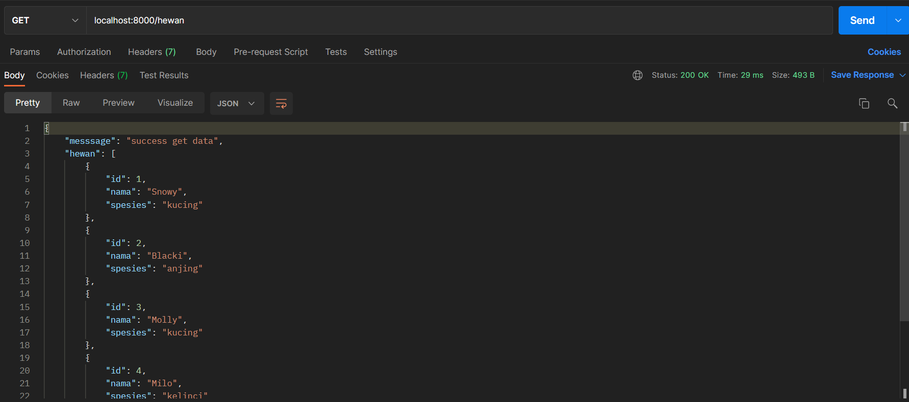
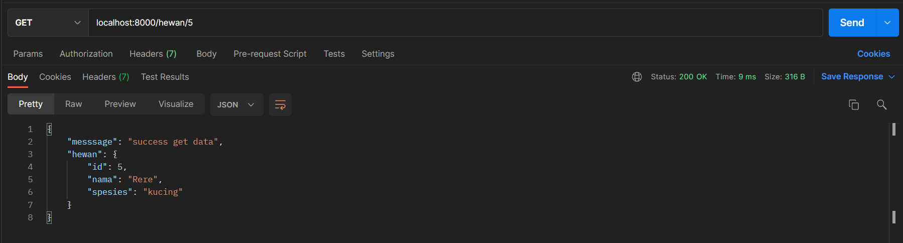
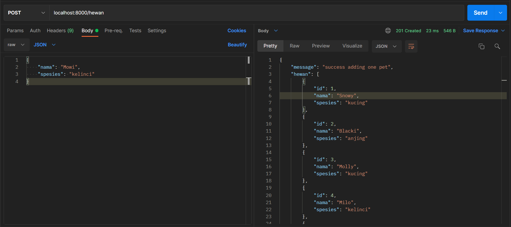
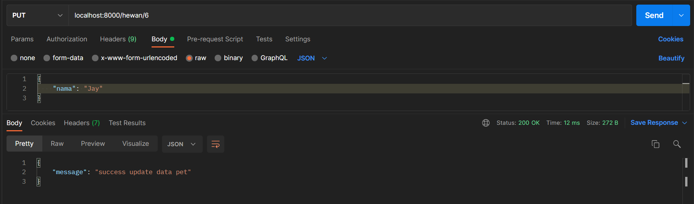
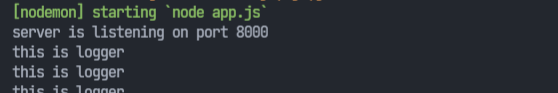
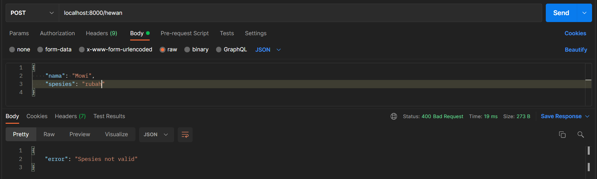

## Result

1. Soal - 01
- Get ALL 

- Get by ID 

- Post

- Update

- Delete

2. Soal - 02
- Middleware Logger   

- Middleware Post Checker

sorry kak kalau caranya beda sama yang diajarin di mentoring, soalnya rekaman mentoringnya gaada suaranya wkwkwk, terus aku minta bantuan temenku suruh ngajarin